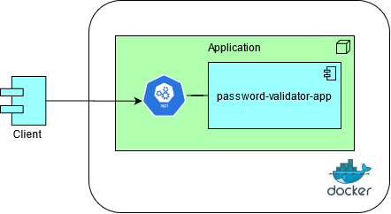
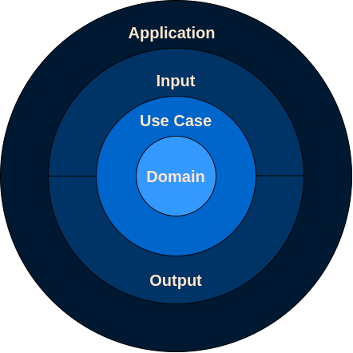
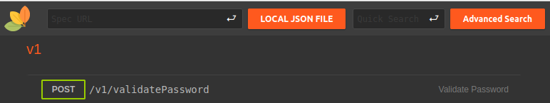

# Case Especialista Engenharia

Para desenvolver este case, utilizei o padrão Clean Architecture, segregando as camadas em packages.

Segui a premissa que cada validação referente ao atributo 'password' recepcionado pela API deveria ser tratado individualmente, sem realizar todas as validações previamente.

Optei por seguir com a parametrização no fonte, com a responsabilidade no UseCase denominado ValidatorDefault, vislumbrando uma possível evolução para uma para uma fonte externa. Obtive este racional (regra no fonte), visando maior performance, dado a regra de negócio específica, daqual pode ser facilmente modificada/customizada.

Por fim e, não menos importante, segui com o lançamento de BusinessError caso alguma regra de negócio não seja atendida, devolvendo assim uma mensagem que faça sentido para o cliente.

## Arquitetura do Projeto

<p align="center">
    
</p>

## Arquitetura da Aplicação

<p align="center">
    
</p>

## Testabilidade

Facilidade na execução dos testes com uma melhor granularidade.

### Unitários
- [JUnit5](https://junit.org/junit5/)
- [Mockito](https://site.mockito.org)
- [AssertJ](https://assertj.github.io/doc/)
- [Mutação](https://pitest.org)


# Executando o projeto

Neste projeto, utilizei o docker como stack. Sendo assim, para validar, basta seguir os passos abaixo:

### Requerido

- Java 11+
- Maven 3+
- docker
- docker-compose

## Build do projeto, já com todos os testes unitários

```bash
mvn clean install
```

## Gerando imagem docker
```bash
docker build -t security/app-spring-jvm .
```

## Iniciando serviço

*O comando sobe toda infraestrutura necessária para a aplicação*
```bash
docker-compose -f .docker-compose/stack.yml up
```

*Agora podemos iniciar nossa aplicação*
```bash
docker-compose -f .docker-compose/spring-app.yml up
```

## Consumindo a API

<p align="center">
    
</p>

Visando obter uma 'interface amigável' com o OpenAPI consumido, optei por utilizar o [RapiDoc](https://mrin9.github.io/RapiDoc/).

Basta acessar [Endereço local](http://localhost:5000) e já pode testar a API
- http://localhost:5000

Na sequêca clique e Local Json File e selecione o arquivo "openapi.json" presente no diretório "openapi" na raíz do projeto.